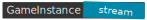

# C++ stream package - GameInstance.com

**stream** package contains streaming C++ components.


## Building stream

Install **gcc** compiler and **make**, then create the work directory structure in which you'll clone
and build the **stream** repository and its dependency: **basics**.

```
mkdir -p ~/gameinstance/BUILD/lib
cd ~/gameinstance

git clone https://github.com/gameinstance/basics
cd basics
make install
cd ..

git clone https://github.com/gameinstance/stream
cd stream
make install
```
